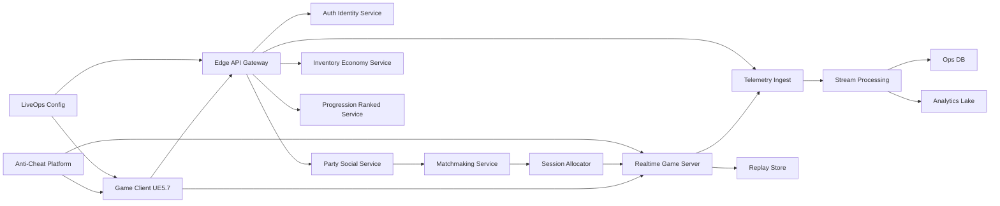

# Project Velocity: Flagship Arena Car-Soccer Platform

## 0. Document Metadata
- Version: 1.0
- Date: February 16, 2026
- Authoring Mode: Product + Technical + Delivery playbook
- Scope: End-to-end PRD, technical architecture, and agent execution instructions for a high-fidelity, cross-platform, competitive arena car-soccer game

---

## 1. Executive Summary
Project Velocity is a competitive, physics-driven arena sports game in the car-soccer genre.

Primary objective: deliver a game that is measurably better than Rocket League in three areas:
1. Competitive integrity (lower latency variance, better anti-cheat, stronger ranked systems).
2. Visual fidelity + performance stability (next-gen graphics with strict frame-time targets).
3. Live operations quality (faster patching, safer deployments, higher uptime, better telemetry-driven balancing).

This document defines:
- Product requirements (what to build).
- Technical architecture (how to build and operate it).
- Agent instructions (how to execute with autonomous engineering agents and strict quality gates).

---

## 2. Product Vision, Positioning, and Principles

### 2.1 Vision
Create the world’s highest-skill, highest-fidelity team-based car-sport game that remains fair and responsive under global multiplayer conditions.

### 2.2 Product Principles
1. Input-to-action responsiveness is non-negotiable.
2. Competitive fairness over visual gimmicks in ranked modes.
3. Cosmetic-only monetization; no pay-to-win mechanics.
4. Platform parity: gameplay consistency across PC and consoles.
5. Operability by design: every system must be observable and debuggable in production.

### 2.3 Differentiation Strategy
1. Physics fidelity tiering:
- Ranked: deterministic-feeling, fairness-first parameter set.
- Casual/Event: optional environmental mutators (wind zones, dynamic surfaces) with separate MMR.
2. Simulation + netcode quality:
- Higher server tick discipline, better loss recovery, lower desync incidence.
3. Competitive ecosystem:
- Tournament tools, replay intelligence, and anti-smurf ranking logic.
4. Content velocity:
- Data-driven arena/mode pipeline enabling frequent safe updates.

---

## 3. Target Users and Modes

### 3.1 Player Segments
1. Competitive climbers (ranked solo/duo/trio).
2. Team squads and clubs.
3. Casual social players.
4. Creators/coaches/esports analysts.

### 3.2 Core Modes
1. Standard Competitive:
- 1v1, 2v2, 3v3.
- Server-authoritative simulation only.
2. Casual Quickplay:
- Rotating mutators and party-first matchmaking.
3. Tournaments:
- Scheduled brackets, in-client registration, live spectating.
4. Training & Coaching:
- Free play, curated drills, ghost replay overlays, shot packs.
5. Custom/Private Lobbies:
- Rulesets, bot fill, observer slots.

### 3.3 Phase Scope
- MVP (internal alpha): 2v2 core with one arena, core cars, ranked prototype.
- Beta: 1v1/2v2/3v3, parties, anti-cheat baseline, progression.
- Launch: tournaments, replay share, battle pass, multiple arenas.
- Post-launch: UGC arenas (gated), seasonal event tech.

---

## 4. Detailed PRD Requirements

## 4.1 Gameplay and Simulation Requirements

### G-001 Car Physics
- Requirement: high-skill movement model (ground, aerial, drift, boost economy, flip cancels).
- Acceptance:
1. Physics step stable at target tick rates over 30-minute soak test.
2. No non-recoverable divergence between server and client prediction in >99.9% of sampled events.

### G-002 Ball Physics
- Requirement: physically coherent bounces/spins with predictable transfer from car contact.
- Acceptance:
1. Collision resolution deterministic within tolerance envelope.
2. Replay determinism checks pass under controlled seeds.

### G-003 Hit Registration
- Requirement: server-authoritative collision result with client-side prediction and reconciliation.
- Acceptance:
1. Median correction amplitude under defined threshold by latency bucket.
2. No hit-confirm cheating path identified in red-team tests.

### G-004 Ranked Integrity
- Requirement: strict MMR + anti-smurf + leaver penalties + seasonal reset logic.
- Acceptance:
1. Match quality score and queue-time SLOs met.
2. Smurf detection precision/recall above threshold during live trial.

## 4.2 Multiplayer and Social Requirements

### M-001 Parties and Cross-Platform Identity
- Requirement: account linking, party invites, cross-platform friends.
- Acceptance:
1. Party join success rate > 99.5% at P95.
2. Invite latency P95 < 3s.

### M-002 Matchmaking
- Requirement: role/skill/latency/party-size aware queues.
- Acceptance:
1. Queue time targets per region and MMR bucket met.
2. Backfill logic works for non-ranked modes.

### M-003 Voice and Comms
- Requirement: team/proximity/party voice with moderation hooks.
- Acceptance:
1. Voice setup success > 99%.
2. Mute/report actions reflected in under 2s.

## 4.3 Content and Economy Requirements

### C-001 Cosmetics
- Requirement: car bodies, decals, wheels, boost trails, goal effects.
- Acceptance:
1. All cosmetics network-safe and performance-budgeted.
2. No gameplay-stat modifiers from cosmetic ownership.

### C-002 Seasonal LiveOps
- Requirement: battle pass, rotating events, store catalog service.
- Acceptance:
1. Config-driven seasonal update without mandatory client patch for most rotations.
2. Rollback possible for bad catalog pushes in < 10 min.

## 4.4 Platform and Quality Requirements

### Q-001 Performance Targets
- Competitive mode targets:
1. PC High-end: 240 fps target (render-scale adaptive).
2. Console Performance: 120 fps.
3. Console Quality: 60 fps locked.
- Frame pacing variance and stutter thresholds tracked continuously.

### Q-002 Reliability Targets
1. Match start success > 99.7%.
2. Mid-match disconnect rate < 0.5% (excluding client network failure).
3. Backend API availability >= 99.95% monthly.

### Q-003 Security and Fair Play
1. Kernel/user anti-cheat strategy with privacy/legal review.
2. Server-authoritative movement and inventory.
3. Real-time abuse and exploit telemetry.

---

## 5. Non-Functional SLOs and Budgets

## 5.1 Latency Budgets (Ranked)
1. Input device to local frame presentation: <= 25 ms at 120 fps path.
2. RTT regional median target: <= 45 ms.
3. Client prediction correction visual threshold: minimally perceptible at P95.

## 5.2 Server Simulation Budget (per tick)
- 120 Hz target for top ranked tiers; 60 Hz fallback tiers if required by cost/region.
- CPU tick budget split example (inference-based engineering target):
1. Physics and collision: 35%
2. Gameplay rules/state transitions: 20%
3. Replication packaging/compression: 25%
4. Safety margin: 20%

## 5.3 Data and Analytics Budget
1. Critical gameplay events loss rate < 0.1%.
2. Observability events sampled by policy to control spend while preserving diagnostics.

---

## 6. Technology Stack Decisions

## 6.1 Game Engine
- Primary: Unreal Engine 5.7 branch (current docs branch includes 5.7 options).
- Language: C++ for simulation-critical systems; Blueprint for non-critical feature iteration.
- Rationale:
1. Advanced rendering stack (Nanite/Lumen/VSM/TSR ecosystem).
2. Mature multiplayer framework (Replication Graph, dedicated server pipeline).
3. Existing ecosystem for competitive game tooling.

## 6.2 Core Service Stack
1. Protocol/API: gRPC for internal services, REST/GraphQL gateway for client-facing non-realtime APIs.
2. Event pipeline: Kafka or managed equivalent.
3. Cache/session: Redis.
4. Primary DB: PostgreSQL for transactional data.
5. Analytical lakehouse: object storage + columnar query engine.

## 6.3 Hosting and Session Orchestration
- Two viable production patterns:
1. Managed-first: PlayFab Matchmaking + Multiplayer Servers and/or AWS GameLift.
2. Platform-control-first: Kubernetes + Agones (session orchestration) + Open Match (matchmaking).

Recommendation:
- Start managed for speed; migrate selective workloads to Agones/Open Match once traffic and cost justify deeper control.

---

## 7. End-to-End Technical Architecture

## 7.1 Client Runtime Architecture
1. Modules:
- Input and camera
- Car movement and ability subsystem
- Prediction/reconciliation layer
- UI/HUD/state machine
- Replay recorder and spectator tools
- Asset streaming and LOD manager
2. Threading model:
- Separate game, render, RHI threads with async loading pipelines.
3. Determinism controls:
- Fixed simulation rate for gameplay-critical systems.

## 7.2 Rendering Architecture

### 7.2.1 Base Pipeline
1. Nanite for high-detail arena assets and complex static geometry.
2. Lumen for dynamic GI/reflections in quality presets.
3. Virtual Shadow Maps for consistent shadow fidelity.
4. TSR default; upscaler abstraction supports DLSS/FSR/XeSS plugins by platform/GPU.

### 7.2.2 Competitive vs Quality Presets
1. Competitive:
- Reduced post-process, lower GI quality, capped effects density.
- Priority on latency and frame-time variance.
2. Quality:
- Full material/shadow/reflection path where hardware allows.

### 7.2.3 Asset Performance Governance
1. Hard budgets per arena for triangles/material instructions/texture memory.
2. Automated render-budget CI checks; reject non-compliant assets.

## 7.3 Physics and Gameplay Simulation
1. Server-authoritative Chaos simulation.
2. Networked physics replication mode selection by object class:
- Default mode for low-risk actors.
- Predictive interpolation for smoother proxies.
- Resimulation for controlled client prediction.
3. Mover framework used for movement components where it replaces legacy movement constraints.
4. Rollback window and correction smoothing tuned per latency bucket.

## 7.4 Networking Architecture
1. Dedicated authoritative game servers only for ranked.
2. Replication Graph for scale and relevance filtering.
3. Delta-compressed state replication + interest management.
4. Tick-rate strategy:
- Tier A regions/ranked playlists: 120 Hz target.
- Tier B regions/casual fallback: 60 Hz.
5. Loss handling:
- Sequence/ack tracking, jitter buffer, selective reliability channels.
6. DDoS and abuse protection:
- Protected ingress, per-IP throttles, signed session tokens.

## 7.5 Backend Microservices

### 7.5.1 Control Plane Services
1. Identity/Auth (account link, entitlements).
2. Profile/Progression/MMR.
3. Party and social graph.
4. Matchmaking and queue service.
5. Session allocator and fleet manager.
6. Store/catalog/economy.
7. Notification service.

### 7.5.2 Data Plane Services
1. Match result ingestion.
2. Replay indexing and retrieval metadata.
3. Telemetry stream processing.
4. Anti-cheat signal ingestion and risk scoring.

### 7.5.3 Storage Layout
1. PostgreSQL:
- Accounts, progression, inventory ledgers, penalties.
2. Redis:
- Presence, parties, queue state, ephemeral session state.
3. Object storage:
- Replays, anti-cheat evidence packages, event archives.
4. Analytics warehouse:
- Event fact tables and model features.

## 7.6 Matchmaking Design
1. Inputs:
- MMR, uncertainty, party size, region latency, platform input type, dodge/leaver score.
2. Matching policy:
- Tight quality-first window that gradually expands by elapsed queue time.
3. Backfill:
- Casual only; ranked uses strict integrity rules.
4. Anti-smurf signals:
- Skill acceleration anomalies, account graph anomalies, hardware fingerprint risk score.

## 7.7 Anti-Cheat and Trust Architecture
1. Client protection:
- Easy Anti-Cheat baseline (free when integrated with Epic Online Services).
2. Server trust:
- Never trust client for movement/hit/inventory outcomes.
3. Behavioral detection:
- Impossible trajectory checks, input entropy anomalies, matchmaking abuse patterns.
4. Enforcement ladder:
- Soft flags, shadow pools, temporary bans, permanent bans with appeal workflow.

## 7.8 Voice, Replay, Spectator
1. Voice:
- EOS voice interfaces with lobby and trusted-server pathways.
2. Replay:
- Use Unreal replay system with server metadata enrichment.
3. Spectator:
- Observer pipeline with anti-stream-sniping delay controls for tournaments.

---

## 8. Build, CI/CD, and Release Architecture

## 8.1 Source Control and Asset Workflow
1. Code: Git monorepo or split repos with strict API contracts.
2. Binary assets: Perforce-backed or Git LFS with clear lock policy.
3. Unreal productivity features:
- One File Per Actor to reduce level-edit conflicts.
4. Build orchestration:
- Horde where appropriate for Unreal distributed build/test workflows.

## 8.2 CI Pipeline Stages
1. Static checks:
- Compile, formatting, lint, API break detection.
2. Automated tests:
- Unit + integration + gameplay deterministic checks.
3. Gauntlet-driven end-to-end game automation.
4. Performance tests:
- Frame-time, memory, network soak.
5. Security scans:
- Dependency vulnerabilities + secret scanning.
6. Artifact signing and promotion gates.

## 8.3 CD and Runtime Safety
1. Blue/green or canary server rollout by region.
2. Matchmaker rule versioning with instant rollback.
3. Feature flags and config hot-reload for non-critical systems.
4. Automated rollback on SLO breach.

---

## 9. Observability, Data Science, and LiveOps

## 9.1 Telemetry and Tracing
1. OpenTelemetry instrumentation across services.
2. OTLP export standard for vendor portability.
3. Distributed tracing IDs propagated from gateway to game session metadata.

## 9.2 Metrics and Alerts
1. Prometheus-compatible metrics for service and game-server health.
2. SLO alerts:
- Match fail rate
- Queue time regressions
- Region packet-loss spikes
- Cheat signal spikes

## 9.3 Player Analytics
1. Funnel: tutorial completion, first win, day-1/day-7 retention.
2. Competitive health: MMR inflation, queue fairness, dodge rates.
3. Economy health: conversion without pay-to-win incentives.
4. Balance analytics: car pick/ban rates, skill-bracket win spread.

---

## 10. Security, Privacy, and Compliance
1. Threat model includes:
- Account takeover, inventory fraud, packet manipulation, DDoS, replay tampering.
2. Mandatory controls:
- MFA options, session token rotation, secrets manager, audited admin actions.
3. Privacy/regulatory:
- GDPR/CCPA data rights, region-aware retention policy, voice/report evidence handling.
4. Incident response:
- SEV0/SEV1 runbooks, legal escalation path, postmortem SLA.

---

## 11. Platform Performance and Graphics Standards

## 11.1 Visual Quality Targets
1. Arena material realism with physically based shading and dynamic lighting.
2. High-density crowd/VFX with strict LOD and culling policies.
3. Broadcast-ready spectator camera presets and replay cinematic tools.

## 11.2 Performance Gates
1. No content merge without passing worst-case arena stress test.
2. Per-platform memory ceilings enforced in CI.
3. Frame-time percentile budgets (P50/P95/P99) tracked nightly.

## 11.3 Graphics Feature Governance
1. Every high-cost visual feature must provide:
- Objective quality gain
- Measured frame-time impact
- Fallback path for low-tier hardware

---

## 12. Team Topology and Resourcing

## 12.1 Core Pods
1. Gameplay/Physics Pod.
2. Netcode/Online Pod.
3. Rendering/Engine Pod.
4. Backend Platform Pod.
5. LiveOps/Data Pod.
6. Security/Anti-cheat Pod.
7. QA Automation Pod.

## 12.2 Suggested Initial Staffing (AAA-scale)
1. Engineering: 35-55
2. Art/Tech Art: 25-40
3. Design: 10-15
4. Production/PM: 8-12
5. QA + Test automation: 15-25
6. Data/LiveOps/SRE/SecOps: 10-18

---

## 13. Milestone Plan (High Confidence)

## 13.1 Phase 0: Preproduction (3-4 months)
1. Finalize physics prototype and camera feel.
2. Stand up backend skeleton and matchmaking prototype.
3. Build reference arena and first content pipeline.
4. Validate 120/60 server tick cost envelope.

Exit criteria:
- Vertical slice with playable 2v2 online matches and repeatable perf metrics.

## 13.2 Phase 1: Production Alpha (6-8 months)
1. Complete ranked core and progression.
2. Add two more arenas and cosmetics pipeline.
3. Integrate anti-cheat baseline and abuse reporting.
4. Build QA automation and soak testing rigs.

Exit criteria:
- Closed alpha with daily matches, stable crash-free sessions, actionable telemetry.

## 13.3 Phase 2: Beta (4-6 months)
1. Cross-platform account linking and parties.
2. Tournament beta and replay-sharing.
3. Economic systems and seasonal configuration.
4. Regional scale tests and canary releases.

Exit criteria:
- Open beta SLOs met in at least three regions.

## 13.4 Phase 3: Launch + Season 1
1. Full service readiness and incident drills.
2. Creator/esports support baseline.
3. Post-launch balancing and retention tuning.

---

## 14. Risks and Mitigations
1. Risk: physics feel degrades under latency.
- Mitigation: dedicated netcode strike team, per-bucket tuning, aggressive replay-based diagnostics.
2. Risk: high-fidelity visuals break competitive performance.
- Mitigation: enforced competitive preset and non-negotiable frame-time gate.
3. Risk: cheat arms race.
- Mitigation: layered anti-cheat with server heuristics and fast policy iteration.
4. Risk: cloud cost explosion.
- Mitigation: autoscaling, matchmaking efficiency tuning, regional cost dashboards.
5. Risk: content pipeline bottleneck.
- Mitigation: strict modular assets, automated validation, parallel art pods.

---

## 15. Agent Instructions (Execution Playbook)

## 15.1 Agent System Objective
Use multiple focused agents to build Project Velocity with measurable quality gates. Every agent must produce artifacts that can be validated automatically.

## 15.2 Global Rules for All Agents
1. Never ship unmeasured performance work.
2. Every PR must include tests and rollback considerations.
3. Do not merge features without observability hooks.
4. If uncertain, run an experiment and publish results.
5. Preserve player fairness over content velocity.

## 15.3 Agent Roles and Charters

### A. Product Architect Agent
- Mission: maintain PRD integrity, prioritize backlog by player impact and risk.
- Inputs: telemetry, design docs, player research.
- Outputs:
1. Prioritized requirements with acceptance tests.
2. Scope decisions for each milestone.
- Definition of done:
1. Every requirement mapped to owner, metrics, and test plan.

### B. Gameplay Physics Agent
- Mission: implement and tune car + ball mechanics.
- Inputs: physics specs, replay telemetry.
- Outputs:
1. Movement components and tuning tables.
2. Determinism and feel reports by ping bucket.
- Definition of done:
1. Physics test suite green.
2. No regression in control responsiveness KPI.

### C. Netcode Agent
- Mission: client prediction, server reconciliation, replication optimization.
- Inputs: latency/loss traces, match logs.
- Outputs:
1. Replication profiles and bandwidth budgets.
2. Desync dashboards and correction tuning.
- Definition of done:
1. Packet-loss resilience tests pass.
2. Desync incidence under threshold.

### D. Rendering Agent
- Mission: achieve visual targets within strict frame budgets.
- Inputs: arena assets, platform perf captures.
- Outputs:
1. Render pipeline configs and scalability tiers.
2. GPU/CPU frame-time optimization commits.
- Definition of done:
1. Platform frame-time budgets met at P95.

### E. Backend Platform Agent
- Mission: deliver reliable services for identity, matchmaking, progression, economy.
- Outputs:
1. Service APIs, schemas, migrations.
2. SLO dashboards and runbooks.
- Definition of done:
1. Load tests pass.
2. Error budgets respected.

### F. Anti-Cheat Security Agent
- Mission: reduce cheating and abuse while minimizing false positives.
- Outputs:
1. Detection rules + ban pipeline.
2. Security threat model updates.
- Definition of done:
1. Detection quality targets met.
2. Appeals workflow operational.

### G. QA Automation Agent
- Mission: keep regressions out through automated validation.
- Outputs:
1. Test harnesses (unit/integration/end-to-end/perf).
2. Nightly report with failures + suspects.
- Definition of done:
1. Critical path automation coverage > agreed threshold.

### H. LiveOps Data Agent
- Mission: balance systems, retention, and monetization ethically.
- Outputs:
1. Weekly balance report.
2. Experiment design and readouts.
- Definition of done:
1. Decisions tied to metrics, not intuition alone.

## 15.4 Agent Hand-off Contract
For every completed task, agents must publish:
1. `Context`: problem and constraints.
2. `Change`: code/config/data updates.
3. `Validation`: tests, benchmarks, telemetry evidence.
4. `Risk`: possible regressions.
5. `Rollback`: exact rollback steps.

## 15.5 Standard Prompt Templates for Agents

### Template 1: Feature Delivery
"Implement [feature] for Project Velocity. Respect constraints: [performance budget], [latency budget], [security requirement]. Produce: architecture note, code changes, tests, benchmark evidence, rollback plan. Fail if any quality gate is missed."

### Template 2: Optimization Task
"Optimize [system] to hit [target metric]. Provide before/after captures, reproducible benchmark method, and identify tradeoffs. Do not change gameplay behavior without explicit approval."

### Template 3: Incident Response
"Investigate [incident]. Build timeline, identify root cause, quantify affected users, propose hotfix and long-term fix, and update runbook with alert tuning."

## 15.6 Pull Request Quality Gates (Mandatory)
1. Compiles and all tests pass.
2. New/changed code paths instrumented.
3. No P95 frame-time or latency regression beyond threshold.
4. Security checklist completed for networked/data-sensitive changes.
5. Runbook/ops docs updated for new runtime components.

## 15.7 Weekly Operating Cadence
1. Monday: plan and risk review.
2. Daily: build health + perf + live incident triage.
3. Thursday: playtest and balance review.
4. Friday: release train go/no-go based on SLO scorecard.

---

## 16. Recommended Initial Execution Order (First 90 Days)
1. Establish authoritative dedicated server loop with one arena and one car archetype.
2. Integrate basic party + matchmaking + session allocation.
3. Implement prediction/reconciliation and collect latency bucket telemetry.
4. Build performance harness and lock competitive preset budgets.
5. Add anti-cheat baseline + abuse reporting pipeline.
6. Stand up CI/CD with automated gameplay and soak tests.
7. Run internal ranked playtests and iterate on feel + fairness.

---

## 17. Decision Log (What Is Inferred vs Sourced)

### Sourced from official docs (see references)
1. UE docs branch availability includes 5.7.
2. Dedicated server requirements in UE (source build/C++ prerequisites).
3. Nanite/Lumen/Replication Graph capabilities and caveats.
4. Iris currently marked experimental in UE docs.
5. Networked Physics replication modes in UE.
6. EOS-related services (OSS EOS features, EOS Plus, voice options).
7. Managed and open-source matchmaking/session orchestration options (PlayFab, GameLift, Agones, Open Match).
8. EAC licensing baseline through EOS.
9. OTel OTLP and Prometheus alerting standards.

### Inference-based engineering recommendations
1. Tick-rate tiering and exact SLO thresholds.
2. Service decomposition and storage schema choices.
3. Staffing plan and milestone durations.
4. Specific anti-smurf model features and enforcement ladder.

---

## 18. Primary References
1. Unreal Engine docs versions and release docs: https://dev.epicgames.com/documentation/unreal-engine/
2. UE dedicated servers: https://dev.epicgames.com/documentation/en-us/unreal-engine/setting-up-dedicated-servers-in-unreal-engine
3. UE Nanite: https://dev.epicgames.com/documentation/en-us/unreal-engine/nanite-virtualized-geometry-in-unreal-engine
4. UE Lumen: https://dev.epicgames.com/documentation/en-us/unreal-engine/lumen-global-illumination-and-reflections-in-unreal-engine
5. UE Replication Graph: https://dev.epicgames.com/documentation/en-us/unreal-engine/replication-graph-in-unreal-engine
6. UE Networked Physics: https://dev.epicgames.com/documentation/en-us/unreal-engine/networked-physics-overview
7. UE Mover: https://dev.epicgames.com/documentation/en-us/unreal-engine/mover-in-unreal-engine
8. UE OSS EOS: https://dev.epicgames.com/documentation/en-us/unreal-engine/online-subsystem-eos-plugin-in-unreal-engine
9. UE Voice Chat: https://dev.epicgames.com/documentation/en-us/unreal-engine/voice-chat-interface-in-unreal-engine
10. UE Replay System: https://dev.epicgames.com/documentation/en-us/unreal-engine/replay-system-in-unreal-engine
11. UE One File Per Actor: https://dev.epicgames.com/documentation/en-us/unreal-engine/one-file-per-actor-in-unreal-engine
12. UE Horde: https://dev.epicgames.com/documentation/en-us/unreal-engine/horde-in-unreal-engine
13. UE Gauntlet: https://dev.epicgames.com/documentation/en-us/unreal-engine/running-gauntlet-tests-in-unreal-engine
14. PlayFab Matchmaking: https://learn.microsoft.com/gaming/playfab/multiplayer/matchmaking/
15. PlayFab Multiplayer Servers: https://learn.microsoft.com/en-us/gaming/playfab/multiplayer/servers/
16. AWS GameLift pricing: https://aws.amazon.com/gamelift/servers/pricing/
17. Agones documentation: https://agones.dev/site/docs/
18. Open Match overview: https://open-match.dev/site/
19. Easy Anti-Cheat licensing: https://easy.ac/en-US/support/game/guides/licensing/
20. NVIDIA DLSS in UE: https://developer.nvidia.com/rtx/dlss/get-started
21. NVIDIA Streamline docs: https://developer.nvidia.com/rtx/streamline/get-started
22. AMD FSR for Unreal (GPUOpen): https://gpuopen.com/unreal-engine/
23. OpenTelemetry specification (OTLP): https://opentelemetry.io/docs/specs/otlp/
24. Prometheus alerting docs: https://prometheus.io/docs/alerting/latest/overview/

