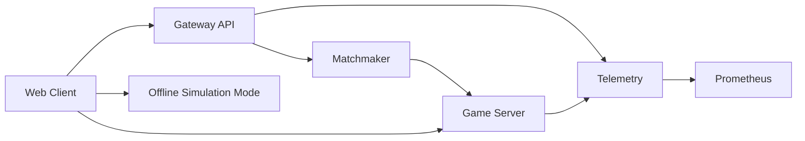

# Project Velocity

A Rocket League-inspired, full-stack multiplayer game prototype built to learn real-world game development:
- server-authoritative simulation
- real-time networking and matchmaking
- gameplay feel tuning (movement, jump, double-jump, ball collision)
- production-style backend architecture and developer tooling

## Live Demo
- Public demo (Vercel): [https://client-two-delta-21.vercel.app](https://client-two-delta-21.vercel.app)
- In-browser mode on Vercel: `Offline Solo` (fully playable without backend)
- Full online mode: run locally with backend services (instructions below)

## Why I Built This
I built this project to go beyond tutorials and practice the hard parts of game dev:
1. Physics-driven gameplay loops at fixed tick rates.
2. Multiplayer authority, latency handling, and state replication.
3. End-to-end system design from game client to services and observability.

## What I Implemented
1. Authoritative game simulation server in Go.
2. 120Hz simulation loop and 60Hz state replication.
3. Car + ball gameplay physics with jump, hold-jump, double-jump, handbrake, boost, and collisions.
4. Matchmaking service with MMR windowing and bot-fill fallback.
5. API gateway with guest auth and matchmaking endpoints.
6. Telemetry service with Prometheus-compatible metrics endpoint.
7. Real-time browser 3D client (Three.js) with HUD, camera, controls, and event feed.
8. Offline solo simulation mode for static deployments (Vercel-friendly).
9. Local orchestration with Docker Compose and one-command local runner.

## Architecture


## Technical Highlights (Recruiter-Focused)
1. Built a custom, server-authoritative simulation loop instead of client-trusting gameplay logic.
2. Implemented jump mechanics with hold-force, sticky force, and double-jump window for better gameplay feel.
3. Designed a matchmaking policy with skill constraints and queue-time expansion.
4. Added bot-opponent fallback for faster playability and easier demos.
5. Created a deployable browser experience that degrades gracefully from online to offline mode.
6. Structured code into clear service boundaries (`gameserver`, `gateway`, `matchmaker`, `telemetry`).

## Stack
- `Go`: simulation and backend services
- `WebSocket`: real-time gameplay messaging
- `Three.js`: browser 3D rendering and camera system
- `Docker Compose`: local multi-service orchestration
- `Prometheus`: telemetry scraping
- `Unreal config templates`: next-phase AAA engine alignment

## Run Locally (Full Online Mode)

### 1. Build and test
```bash
make tidy
make build
make test
```

### 2. Start everything
```bash
make run-full
```

### 3. Play
Open: `http://localhost:5173`

Controls:
- `W/S`: throttle / reverse
- `A/D`: steer
- `Shift`: boost
- `Space`: jump / double-jump
- `Ctrl`: handbrake

## Run with Docker
```bash
make up
# open http://localhost:5173
make smoke
make logs
make down
```

## Validation and Quality Checks
- Unit tests for simulation and matchmaking
- Build checks for all Go services
- End-to-end smoke test (`auth -> queue -> assignment`)
- Health endpoints on all services

## Project Structure
- `backend/cmd/gameserver`: authoritative simulation + websocket server
- `backend/cmd/gateway`: auth and API edge
- `backend/cmd/matchmaker`: queueing and match assignment
- `backend/cmd/telemetry`: event ingest + metrics
- `backend/internal/simulation`: core gameplay physics and rules
- `backend/internal/matchmaking`: matchmaking logic
- `client`: playable web client
- `infra`: Docker and Prometheus config
- `scripts`: local runner and smoke tests
- `docs`: architecture and graphics specs
- `unreal/templates`: UE 5.7 config starter templates

## What I Learned
1. Gameplay feel depends heavily on iteration loops across physics, camera, and input handling.
2. Networked games require strict authority boundaries to avoid desync and exploit paths.
3. Fast prototyping still benefits from production habits: tests, health checks, telemetry, and clear module boundaries.
4. Public demos are easier to share when an offline fallback mode exists.

## Roadmap
1. Persistent progression and ranked data (PostgreSQL + Redis).
2. Replay capture and retrieval.
3. Anti-cheat signal pipeline and rule engine.
4. Stronger client prediction/reconciliation path.
5. Unreal native client integration for higher-end graphics.

## Disclaimer
This is an original learning project inspired by the car-soccer genre. It is not affiliated with or endorsed by Psyonix/Epic Games.
